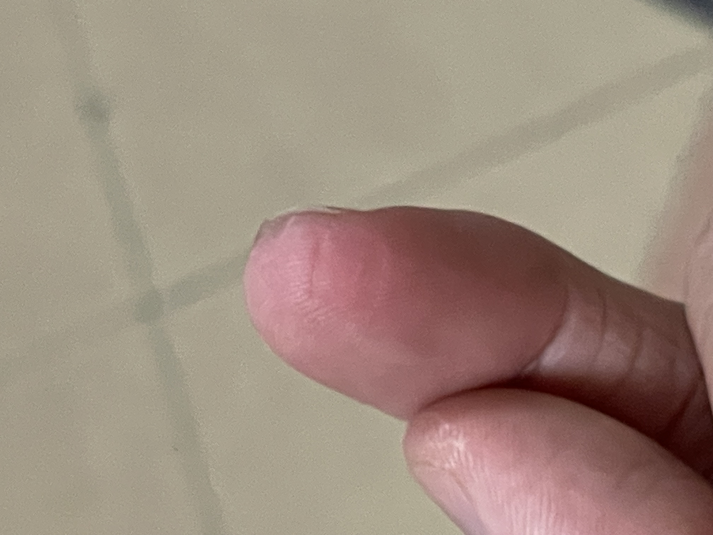


 [Github Repo](https://github.com/vdhorstnigel/EE4002D_FRESH) 
 [Github Pages](https://vdhorstnigel.github.io/EE4002D) 
 C 


Embedded Electronic Nose: FRESH System for Fridge Food Monitoring 

Ensured freshness of food in a fridge using an embedded electronic nose with machine learning to detect foods that are spoiling.

Using ESP32-S3-DevKitC-1U-N8R8, SEN0567, SEN0568, SEN0569 and SPEC Ethylene Sensor 110-650 with a LCD screen attachment.

Developing the code using vscode and ESP-idf

## ESP-IDF vs Arduino vs Micropython:
### ESP-IDF:
I am using the ESP-IDF as there is a supported plugin on vscode for it, its more modular as I can separate each function in its own C file, its lightweight and fast. I can also work on the machine learning code without the microcontroller as I can run and compile C on my computer.

### Arduino:
Arduino is much more simpler to use, with many libraries available that I can use but its not as modular. As this project is a pair project, only one person has access to the ESP micro controller, so its difficult to do collaboration if we use arduino. I am also less familiar with arduino. It also slightly more bloated than pure C.

### Micropython:
Micropython is the easiest language to use and I am the most familiar with it, but it suffers from performance. However, it would be the best backup as it is the best suited for machine learning.

## Topics learnt:
Header vs C files
static & volatile variables

## Reading the analog sensors:
To read the analog sensors, I connected the sensors to the GPIO pins on ADC1, ADC2 is not recommended to be used as its reserved for WIFI.
I use the esp adc oneshot libary to get the values instead of the continous library as I only get the values every 3 seconds, it would be easier than constantly reading the the sensors and get a sample instead. Currently I can only gurantee the humidity and temperature sensor working, Im unsure how to ensure that the VOC sensors is giving accurate values.

## Wifi connection:
For the wifi, I used the wifi_connect library and modified the code slightly to what I need. This works well very well except that the antannae is not strong enough and need an external antannae to connect better. I also used a WIFI_CONNECTED flag that i set to true or false if the wifi is connected. This allows me to only send data when wifi is connected. I read that using Xeventgroup is good to wait til the wifi is connected before proceeding however, I do not know if this is suitable for my need. I will continue using the wifi_connected flag first.

## MQTT broker:
For MQTT connection, I was initially using the sample mqtt5 program given, but it was very convuluted and bloated. So I decided to keep only the mqtt initialization and do a single publish using esp_mqtt_client_publish. I also had to import the certificate to connect to the broker over mqtts.
The photo below shows me being able to receive the values from the esp32 over mqtt, the esp32 is actually in my fridge now getting the values!

## Why Wifi and MQTT is so important:
Wifi and MQTT allows my esp32 to send the values from my esp32 to a data silo, allowing me to retrieve the values I need from the pc. I can get real data from the fridge without connecting to my pc! This also allows me to test my machine learning algorithmn on the pc first with the data from the esp32.

## Initial data collection test with banana 04/06/25 5:30pm - 09/06/25 10pm:
Im using a cut banana in the fridge, this allows the banana to spoil faster so that we can collect some reference data. After around a day plus, not much change is noted but the ethanol has been on a decline which is weird to me, banana looks drier but not spoilt yet. After 2 days ethanol levels has been fluctuating like a sine wave, but seems to be declining which is unexpected.

Unfortunately, my powerbank ran out of power and I was unable to fully capture the spoiling process. Furthermore, the mqtt client was disconnecting intermittently. But we can see how the VOC changes according to time with this preliminary data. Excluding the EtOH spike which is most likely an outlier, we can see that there is a significant increase in the VOCs, notably H2S and Ethanol. This shows that the VOCs can be captured and this is a viable project. However, more testing is required.

## Issues Faced:
### Wifi was intermittent and could not connect frequently:
Attached a simple antennae to the ESP to increase the strength. 

### LCD had no inbuilt library and was difficult to configure the output:
Tried integrating the Arduino-LiquidCrystal-I2C library but I'm using ESP-IDF 5.4.1 which does not support arduino. Integrated this library instead https://github.com/abdellah2288/esp32-i2c-lcd-driver

### Main code stopped running after initializing wifi
Found out that loose cables made the initializing fail when trying to read the sensors, always ensure your connections are secure!

### LCD stopped working and sensors values inaccurate:
One of the sensor got shorted, causing voltage issues when reading the analog output. It also heated up really quickly and burnt my finger when i check on it, I only knew it was burning when i smelt something burning. So please check your connections carefully!

### Tensorflow did not run:
Tensorflow does not support my python version (3.12), I had to install python version (3.11) for it to work

### Sensors were given the wrong values:
Originally I was using GPIO 4,5 for my humidity and temperature sensor which worked well. GPIO 6,7 for my I2C LCD which also worked well and GPIO 8,9,10 for my VOC sensors which wasnt working, they always gave a max 4095 value which was weird. Apparently, the GPIO pins were being used for the flash memory and there was a conflict? Im not too sure, but i remapped the pins. My humidity and temperature sensors are using GPIO 1,2. My I2C LCD is using GPIO 20,19 which is the recommended pins from other blogs. My VOC sensors are using GPIO 3,4,5 and its working now! I tested by spraying my cologne near the ethanol sensor and it spiked up. So be careful to check that pins are not conflicting, I read that I am not supposed to use ADC2 as well because the bus is shared with the WIFI and it will interrupt the reading, although you can probably queue the process nicely to avoid that, its easier to just use another pin as they provide plenty.

### MQTT disconnecting every 2 hours
MQTT would disconnect every 2 hours, suspected that the session expires and the client doesnt reconnect. Changed the expiry interval to infinite so it doesnt expire, enable auto-reconnect, and added a fail safe to check if mqtt_client is connected before sending the values to mqtt to prevent loss of data. Will continue to monitor. Currently the sessions are not expiring but messages drop to 0 after around 18 hours, more logging needs to be done to find the root cause.

### Security
My javascript website that is hosted on github pages has the broker infomation and credentials, Which is vulnerable as people can easily see the broker credentials and enter faux data, I assigned a read only account for my website reducing the vulnerability, have to find a better solution next time.
My code also had hard coded credentials, added credentials to gitignore. Decided against doing env variables for esp32