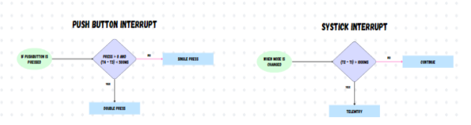
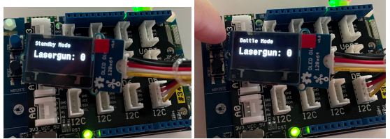
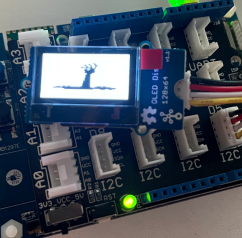


This project was done before this blog and most information is from my report



 [Github Repo](https://github.com/vdhorstnigel/Microcontroller-Drone) 
 C 


Board Used:stm32l475vg

Sensors Used:
| Sensors  | Usage|
| ------------- | ------------- |
| Accelerometer | Used to measure the z acceleration and detect if the drone is upside down and therefore “attacked” (< -6 m/s^2 indicates drone is upside down) and trigger The Last of EE2028. Measured in m/s^2.|
| Gyroscope     | Used to measure the angular velocity (rotation) in all the 3 dimensions. Take the overall magnitude of all dimensions to find if the drone is suffering bad turbulence (> 5 rad/s indicates a chance of crashing). Measured in rad/s |
| Magnetometer  | Used to detect magnetic fields and can therefore detect dangers for humans (eg:bombs) (> 500 uT indicates a chance of a bomb present). Measured in uT. |
| Temperature Sensor | Used to measure surrounding temperatures. Check if the temperature of the surrounding is less than 40 deg C (> 40 deg C indicates too hot for humans to live). Measured in deg celsius |
| Pressure Sensor | Used to measure the atmospheric pressure. The atmospheric pressure can indicate the height of the drone or the current weather. If the measured pressure is less than 1000 mb (millibar), it indicates that the drone is too high and may lose connection to the base or indicates a chance of a storm coming. Measured in mb.|
| Humidity Sensor |  Used to measure the relative humidity. Check if relative humidity is more than 50%rH.( < 50%rH means not enough humidity for humans, allowing for virus to spread more easily). Measured in %rH |
| Humidity Sensor |  The OLED Display allows for minimal level information display on the drone without a serial connection. It is able to display the 3 operating modes of the drone, Lasergun energy level, Lasergun firing, Last of ee2028 countdown and final message. This allows us to do low level troubleshooting without connecting to the drone. |
| Buzzer | The buzzer gives the drone sound feedback for warnings. The buzzer is activated when the lasergun is fired and during the countdown of the last of ee2028. |

Intially, we used the HAL delay library to write a delay of 1 second, but we learnt that it waste a lot of computer cycles as it does not do anything for 1 second. We learned to get the systick and calculate the difference in ticks to count 1 second instead. This allows us to do some interrupts as well.
For pushbutton interrupt, we can take the ticks measured when the button is pressed. If the difference is less than 1 second, its considered a double press, and if the difference is more than 1 second, its a single press. We use a flag to differentiate single and double press.

Detailed implementation of the sensors:

Accelerometer
The value obtained from the BSP function is in mg. We would need to convert it to m/s^2 by taking mg * (9.8/1000). We then only return the Z acceleration to detect if the drone is upside down and therefore attacked.

Gyroscope
The value obtained from the BSP function is in mdeg. We would need to convert it to rad/s by taking mdeg * 1/1000 * pi/180. We then return the overall magnitude. This allows us to detect if the drone is undergoing turbulence.

Magnetometer
The value obtained from the BSP function is in mgauss. We would need to convert it to uT by
taking gauss * 1/1000. We then return the overall magnitude. This allows us to detect magnetic
fields near the drone. This can indicate a potential bomb nearby thus allowing the drone to scout
for landmines.

Temperature Sensor
The value obtained from the BSP function is in degC. We can use this reading to determine if
the surrounding temperature is too hot for humans.

Pressure Sensor
The value obtained from the BSP function is in hPa. We would need to covert it to mb, it is a 1 to
1 conversion ratio.We can use this reading to determine the drone height or if a storm is
impending.

Humidity Sensor
The value obtained from the BSP function is in %rH. We can use this reading to determine the
relative humidity is sufficient for humans to live in.

Enhancements used: Buzzer and Oled Screen

The OLED is using I2C1 to communicate with the board, we used GPIOB8 & GPIOB9 in AF4
mode for I2C1 SDA and SCL. Then using an external library we can call a function to fill the
display as black to clear it, set the cursor, print out a formatted line and update the screen. I really wanted to add a bitmap to my project as i thought that it was a cool addition, so i set up the bitmap to appear when the drone dies.

The buzzer buzzes during Last of EE2028 countdown and during Lasergun Firing. The buzzer GPIOB1 for arduino pin D6 and buzzes when a high is written to the pin. Originally I wanted to change the frequency of the buzzer to sound more like a lazer gun, however I was unable to write the frequency and could only output a digital high to the buzzer to sound it.

Issues faced
Hard fault during sprintf for float values:
I was unable to solve this issues, sprintf just did not want to work with float values for this board, So i divided the float into 2 ints which solved it temporarily.

Accuracy of sensors:
Another issue was reading the values from the BSP function and converting them to the
appropriate units. To this we can follow the suggestion of reading the datasheet to see the
sensitivity and then reading the BSP function to see how the return value is calculated.
However, I was still unsure of how accurate this reading was. The solution was to use matlab.
For example, we can use stm32l475vg_humidity_temperature_sensor command to generate a
model to measure humidity and temperature. We can use stm32l475vg_magnetometer_sensor for M, stm32l475vg_accel_gyro_sensor for
A&G and stm32l475vg_pressure_sensor for P. However, some of their sensors are not
configured correctly and their measurements are using the wrong units. However, it is still a
good way to double check our readings. Also Matlab simulink uses com3 to communicate with
the board, therefore we cannot use teraterm for UART at the same time.

Issues or suggestions: Please feel free to give us some feedback to make
this course a better one . Your feedback, whether positive or negative, will
not affect your marks.
This course can consider using arduino for micro controllers as STM32 does not seem
frequently used outside.
The projects in this course could be done solo as sharing the board is difficult between
teammates and can reduce productivity.

Conclusion
This assignment taught us how to use the STM32CubeIDE for debugging as well as an IDE for
us to write code in. It also taught us how to research on our own using the device manual and
datasheet instead of googling everything or asking teachers. This skill will definitely be used in
the future where we would need to research the solution on our own instead of depending on
supervisors. No help was given also for enhancements, forcing us to self learn and depend on
our own interpretation of the datasheet. Leading us to research more about a deeper
understanding for the STM32 board. We also learnt using various tools such as teraterm for
serial communication and matlab simulink. We also learnt how to implement external drivers for
the OLED boards.
