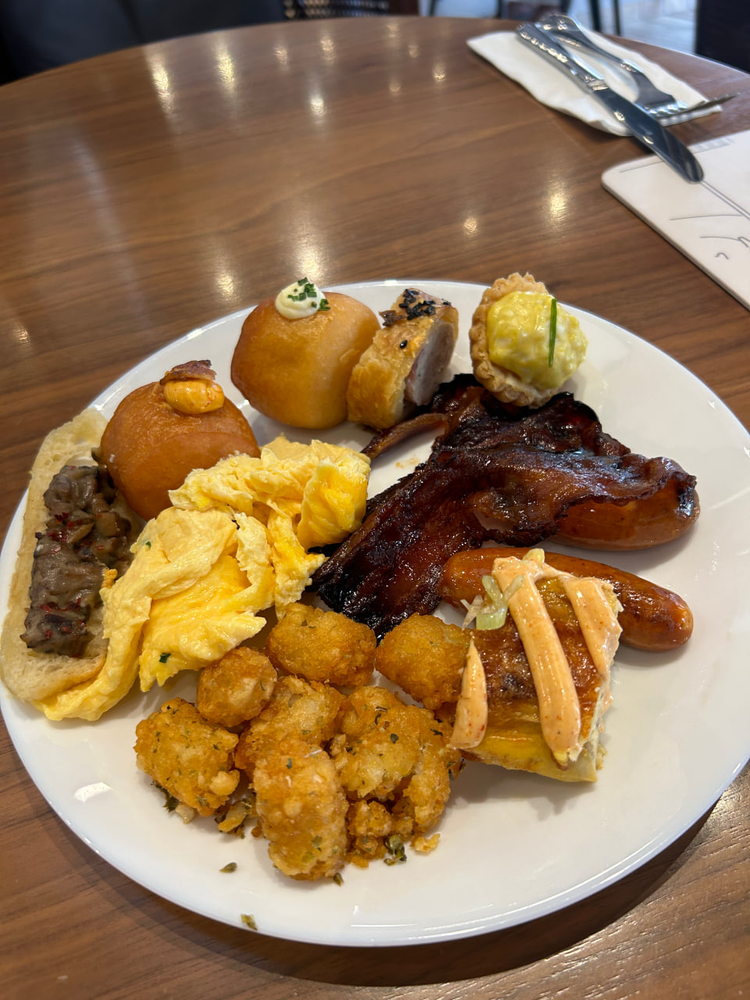
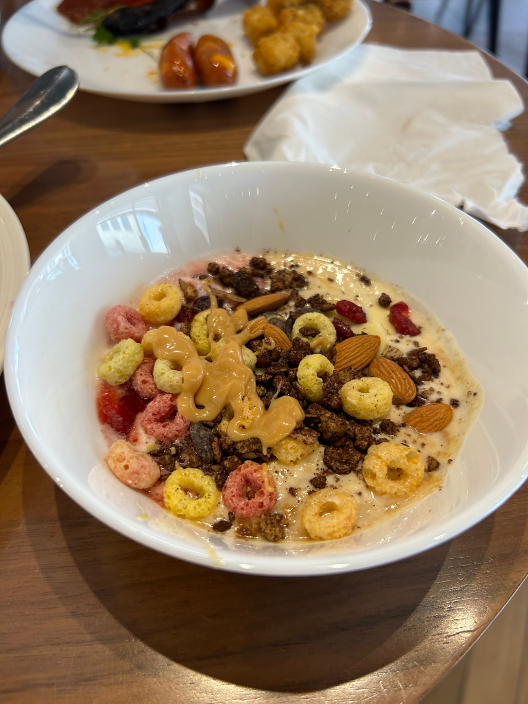
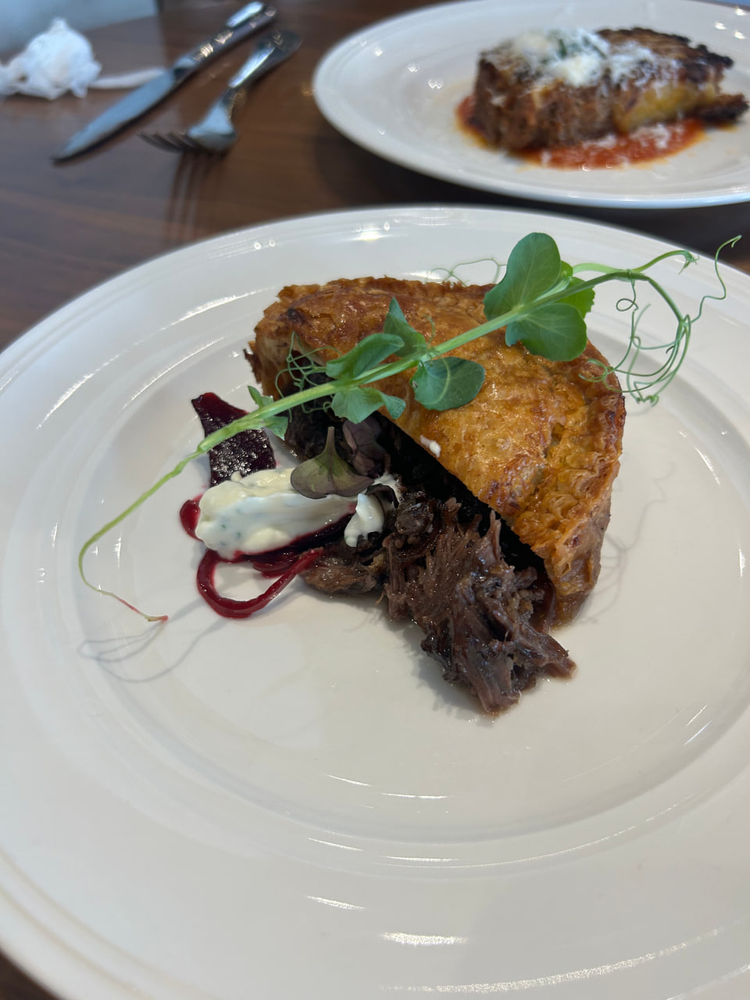
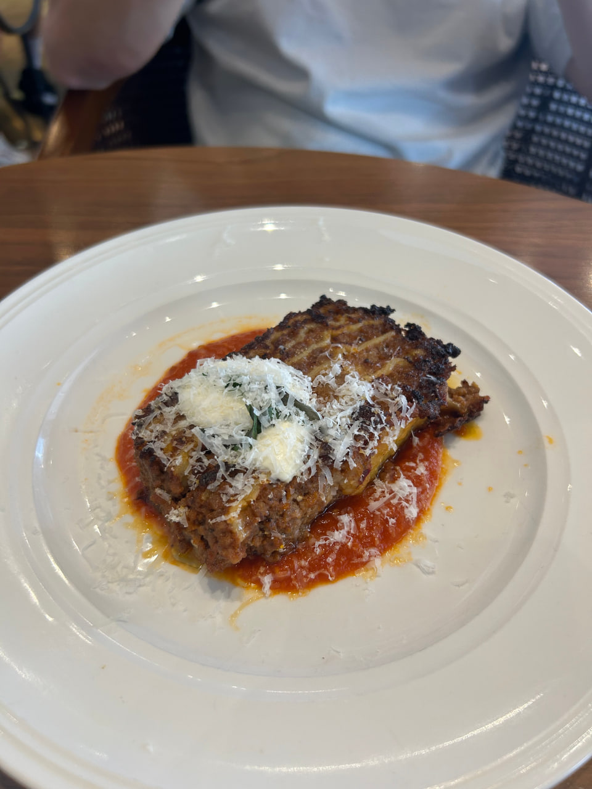


131 E Coast Rd, Singapore 428816


Rating: 

Came to experience the highly raved 38++ brunch buffet but left very disappointed.

Ordered the lasagne but felt it was very mediocre, the brunch spread was quite wide but felt like most dishes did not satisfy me. The one dish I particularly liked was the candied bacon but this wasn’t even the best candied bacon I had in singapore.

The service staff was very nice, patient and helpful but felt like the event was badly managed overall. We made a reservation for 2 at 1.30pm but had to queue and only got seated at 2pm, people who arrived later just cut our queue as well and nothing was being done. Had to rush to finish the brunch as the buffet spread closed at 3pm.

The atmosphere was very loud and hard to have a nice conversations as everyone is talking so loudly and babies crying all around.

Overall, quite disappointed in the brunch buffet and definitely will not be returning :(.

GF review:
was really looking forward as online videos made it seem like the spread was very wide but honestly, not the biggest. a lot of the items especially their savory dishes seemed like low cost filler items, like tater tots, and various scrambled eggs.

for my main dish i did get the recommended beef pie. the beef was tender and paired quite nicely with the beetroot. however, the crust was painfully stale and just like most of the other dishes, it was somewhat cold.

the yogurt station was quite nice, with a variety of different toppings. the sweets/desserts were nice as well but not amazing.

overall, i find that for $38, more “value” dishes should be provided. coupled with the loud environment and crowd, i would say this place is overhyped. only come here if u have money to spend, not for mindblowingly good food.

