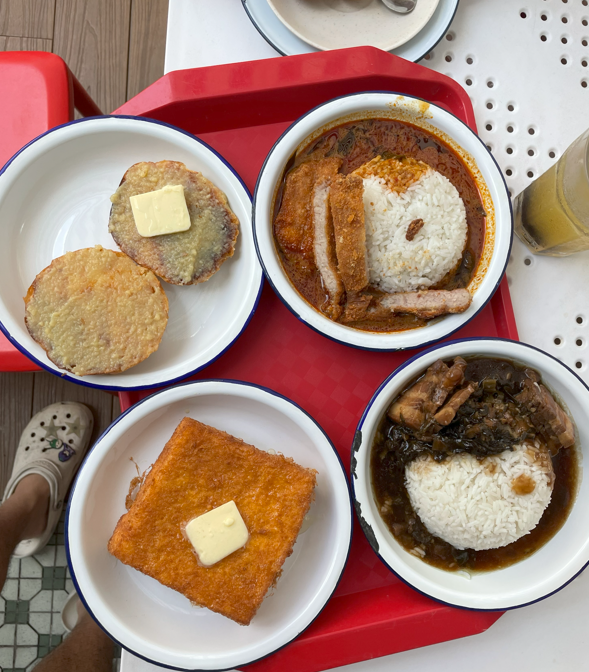
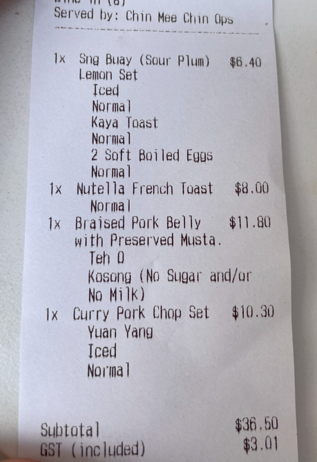


204 E Coast Rd, Singapore 428903


Rating: 

Ordered the kaya toast set with iced drink - $6.40
Nutella french toast - $8
Braised Pork belly with preserved vegetables - $11.80
Curry pork chop set - $10.30

The kaya toast was an interesting experience
, homemade kaya that wasn’t too sweet on their own bun. Personally, i prefer the square toast to dip into the egg. They could have also been more generous with the butter. The eggs were so creamy and cooked well. I think the set was priced quite reasonably. 6.5/10

The nutella french toast was a complete disappointment, it was too dry and eggy. The nutella was minimal. Honestly just tasted like an egg toast with nutella and some butter. 2/10

gf review
i ordered the pork chop curry rice and the yuan yang beng. overall quite mediocre with standard portion size. the curry was sufficiently fragrant but the pork chop could’ve been fresher. the drink had a nice chocolate aftertaste for some reason? but was still yum. overall, this place is charmingly old school, not overly expensive for east coast but more for aesthetics and vibes.

