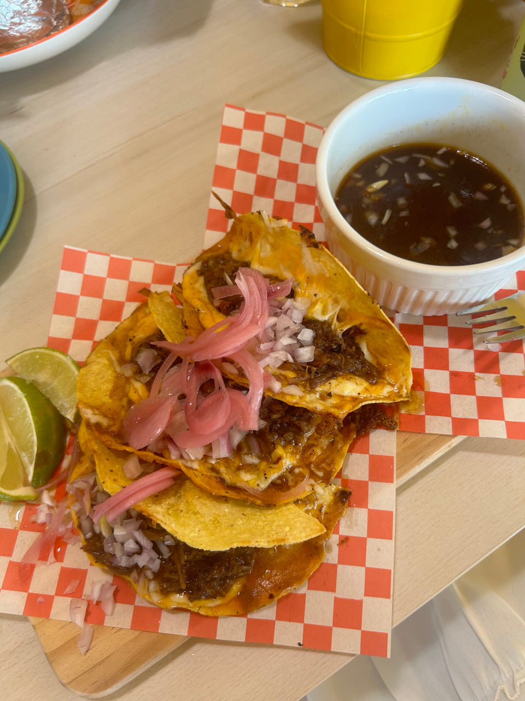
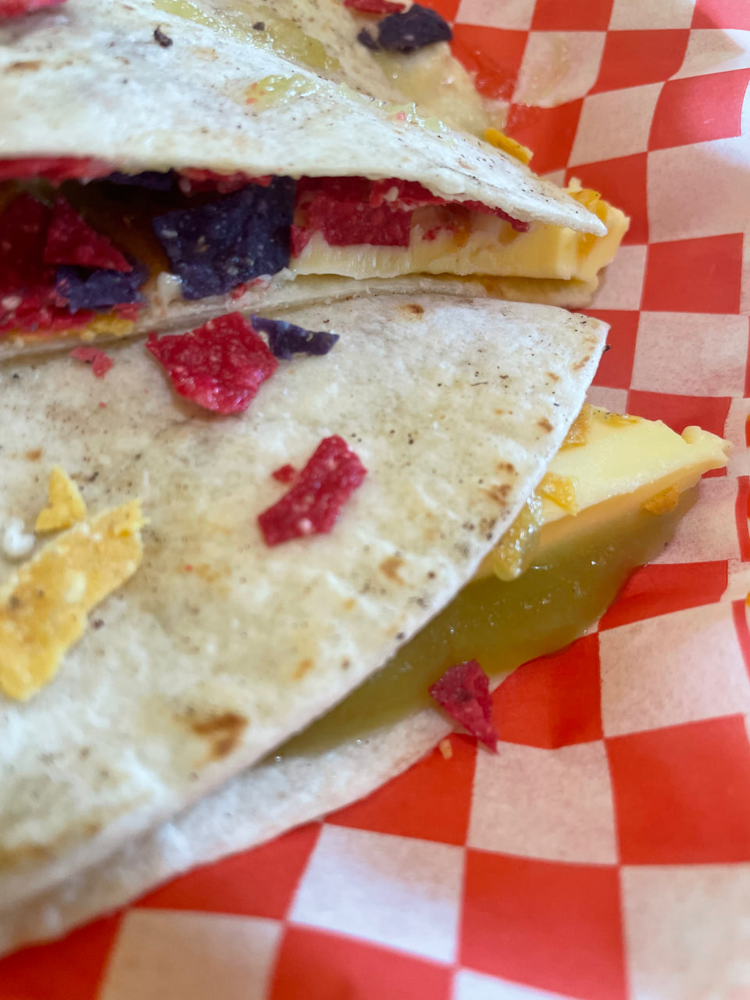
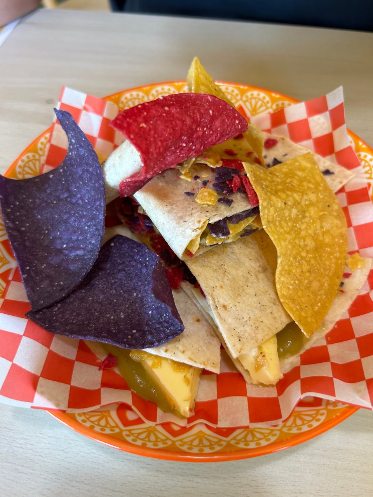
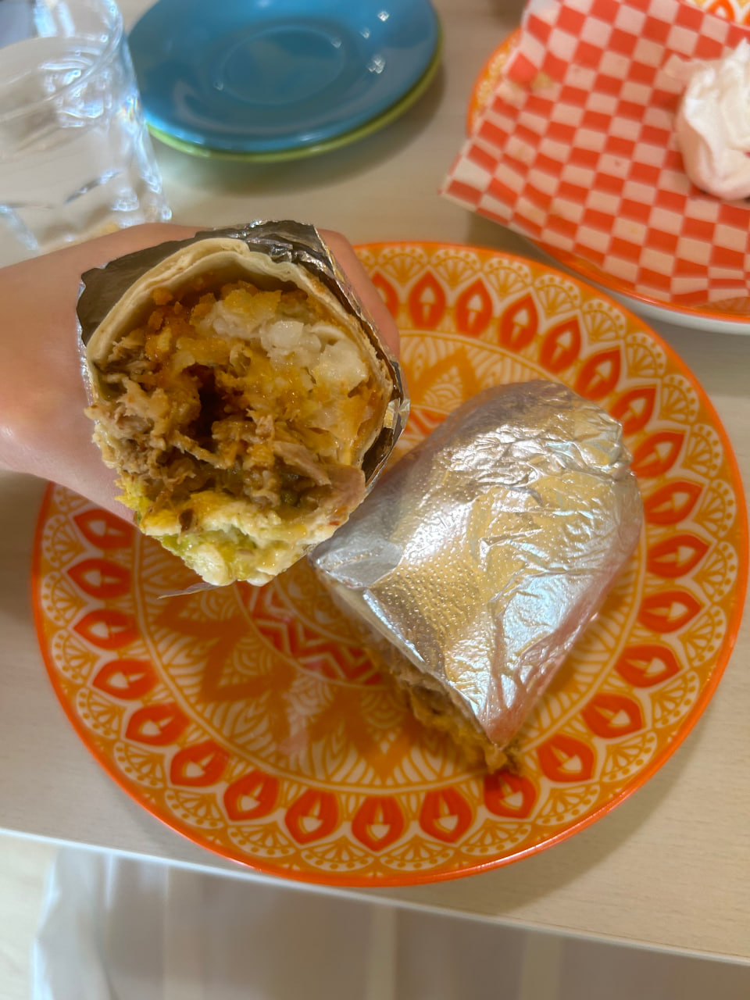


681 Race Course Rd, #01-305, Singapore 210681


Rating: 

Truly quite a hidden gem for mexican fusion!
Came here during brunch time and it was very warm and friendly. The price is slightly on the higher side but fret not as they accept SG60/CDC voucher so please do support local!

Ordered the kaya butter wrap - 6, breakfast wrap - 16.9, birria beef tacos (3pc) - 19. The kaya butter wrap surprised me, it came with a thick cold slab of butter and adequate kaya, I wasn’t expecting the combination to work out but it worked out really well! The breakfast wrap was absolutely smashing as well, it was filled and packed tightly with all of the classic breakfast foods and overall a really good combination.

GF review:
personally i really like the birria tacos. it’s savoury and sour flavours really come through in the consome. the red onions sprinkled on top pair wonderfully with the entire taco. definitely a messy dish but if u don’t mind it’s totally a must get. a bit of their salsa compliments the decadent dish as well. however for $20, i wouldn’t come here often unless i have more cdc vouchers to spend, simply because it’s too much money to spend on a meal (not because of lack of better taste).

