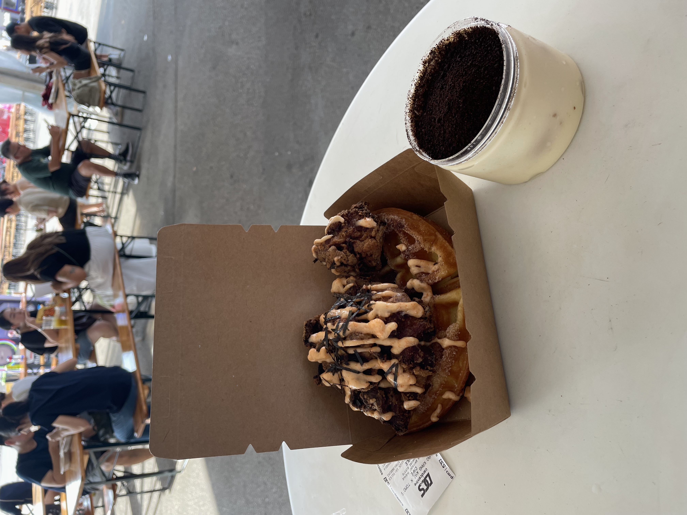
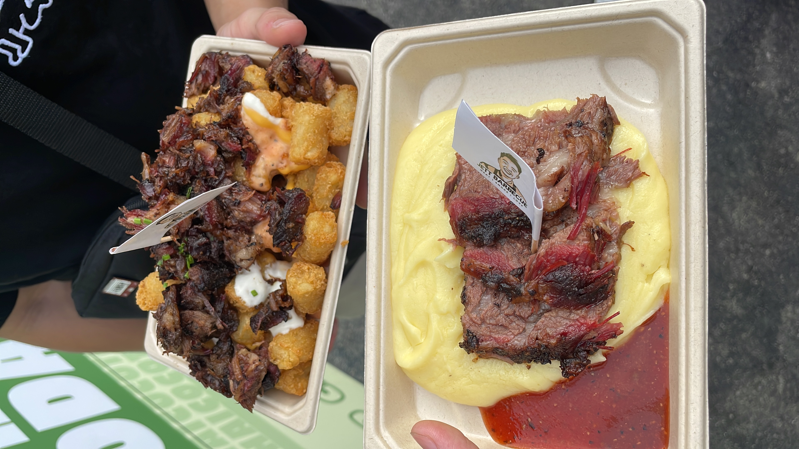
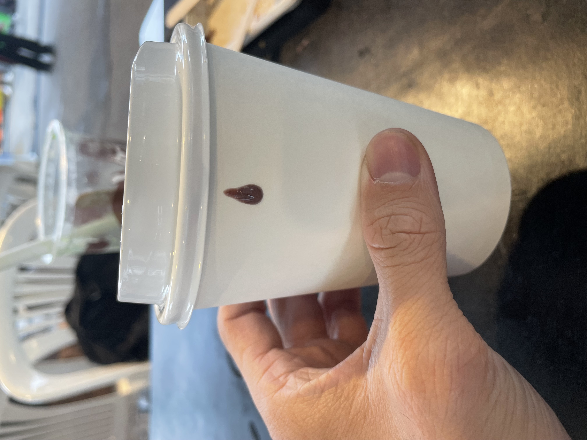


Bayfront Events Space


Rating: 

My very first Gastrobeats event!
Came here around 4pm as it opens which was a big mistake, it was extremely hot. There is also a bagcheck and they did not allow outside food and drinks including plain water! Best to come when the sun has set and its more cooling.

First stop is Tomo express and Hao Kang Kai, which is co-owned by a friend. Ordered the Chuffle with mentaiko chicken ($17), slightly on the pricey side but very delicious and refreshing to see. The homemade tiramisu ($10) was extremely well made and it was perfect for such a hot day and when paired with the chuffle, which is waffle made of churros batter btw, is an unbeatable combo. I only wished they had more dessert options for the heat.

Secondly, We went to Jett Barbeque which has a very long queue. We saw that it was famous and wanted to check it out. We ordered the loaded tater tots ($16) and some beef brisket with mash ($22.50). The loaded tater tots was really loaded and I really like the cuts they gave as they were crunchy. The beef brisket was very tender and the mash was creamy and salty, but for 22 dollars it was hard to justify.

Lastly, I saw a acai smoothie that really caught my eye, the picture looked so enticing and for 8 dollars, I couldnt resist the temptation. But imagine my surpise when I receive this. It was way smaller than I thought and way too sweet. Honestly regretted this alot. I dont really remember the store I bought from

All in all, I think gastrobeats isnt so bad if you go at night and prepare your wallet. Be sure to look around and see what other are having as some of their promotional boards do not really display accurately what they sell.