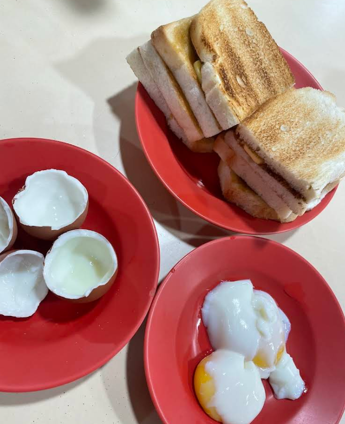


24 Sin Ming Road, #01-51 Jin Fa Kopitiam


Rating: 

Came here to experience the legendary charcoal kaya toast but left very disappointed. Toast was barely toasted and no charcoal smell or taste at all, just like normal bread with slight toast. Butter was very good but barely had any kaya to complement it. Ordered 4 slices with Kopi o kosong and Teh bing but did not know that eggs were to be ordered separately. Had to wait another 5 mins for eggs to be served while our kaya toast went cold. Eggs were also served half boiled when we wanted soft boiled. Requested for black sauce but was only given white or black soya sauce for eggs. Teh bing was standard but kopi was abit too acidic for my taste. Paid 9.70 for in total, which is a bit sad for this quality. Sad to say this was quite mid and i don’t get the hype.

TLDR: Ultimately, this was just simple kaya toast, nothing special and overpriced.

