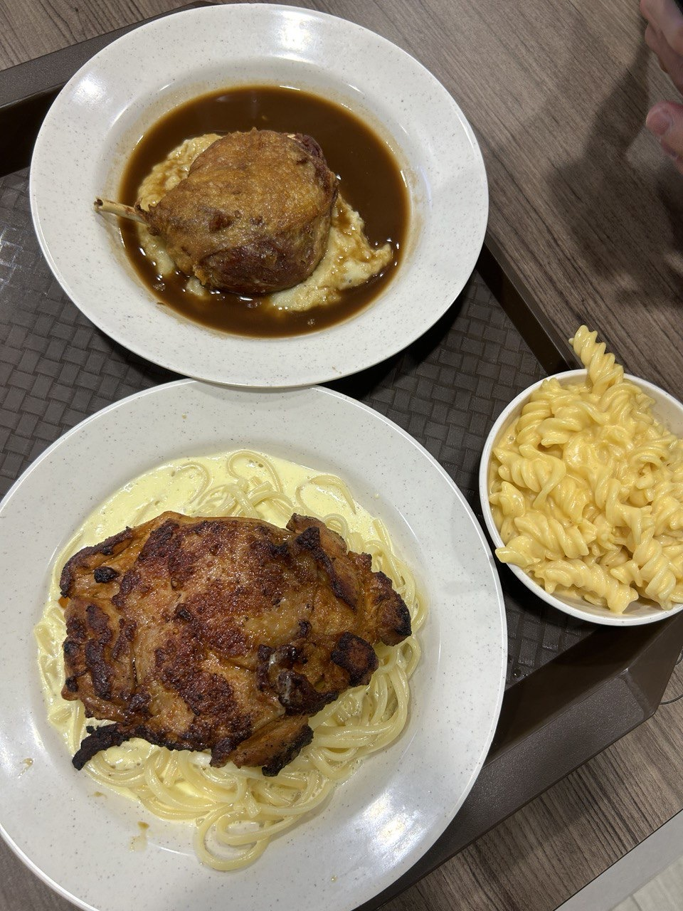
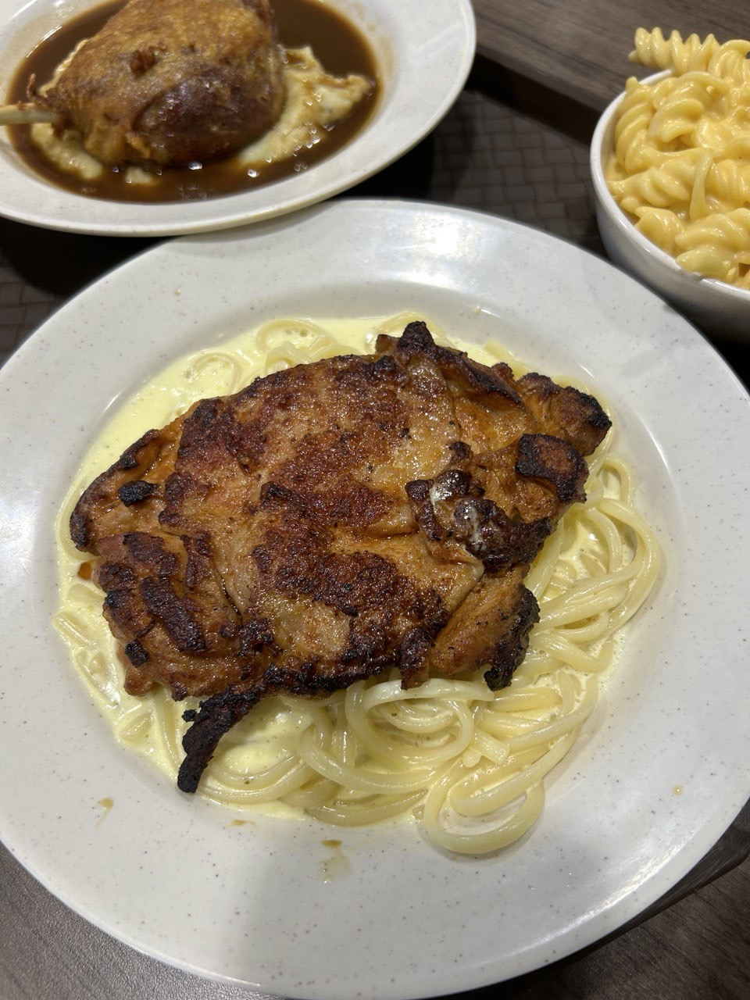
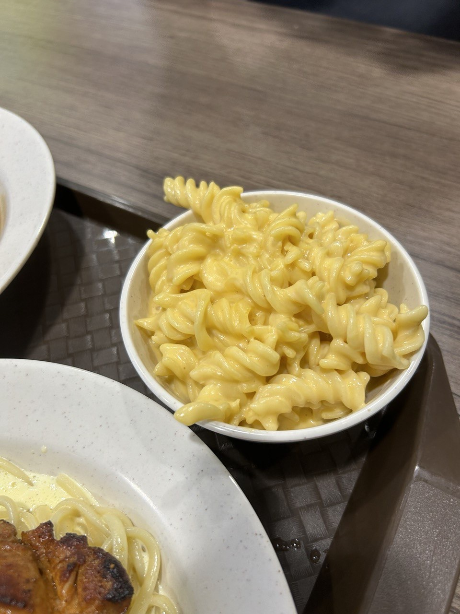
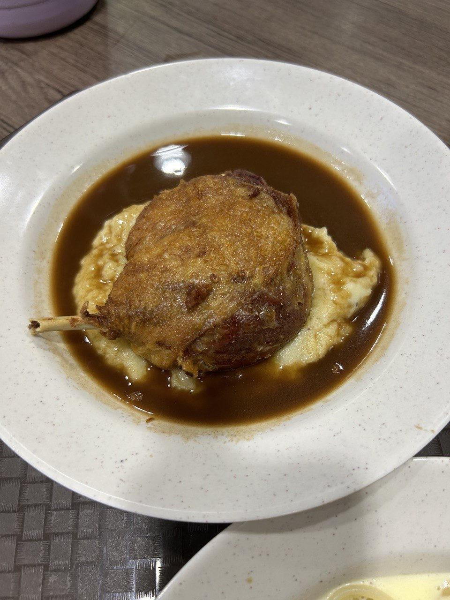


202C Woodleigh Link #01-30 Woodleigh Village Hawker Center


Rating: 

Once again held in woodleigh village, this store offers affordable yet tasty western food with great portions!
Ordered the creamy pasta and chicken chop - $7. The chicken chop is very nicely grilled with a decently strong char grilled taste, tender and seasoned nicely. Not the biggest fan of the cream pasta, but well worth it for the price, 7/10.
Got fusilli & cheese - $4, tasted just like old school canteen mac and cheese, was not too bad 6/10. kids will love this option

Gf review
my dunk confit, although small, was nicely roasted and served on top of mash potatoes and gravy. the gravy had a slight wine taste which added more flavour. the duck was slightly dry but with the gravy was yummy. for $14.90, this is probably one of the cheaper options for duck confit and honestly not bad, 7/10

