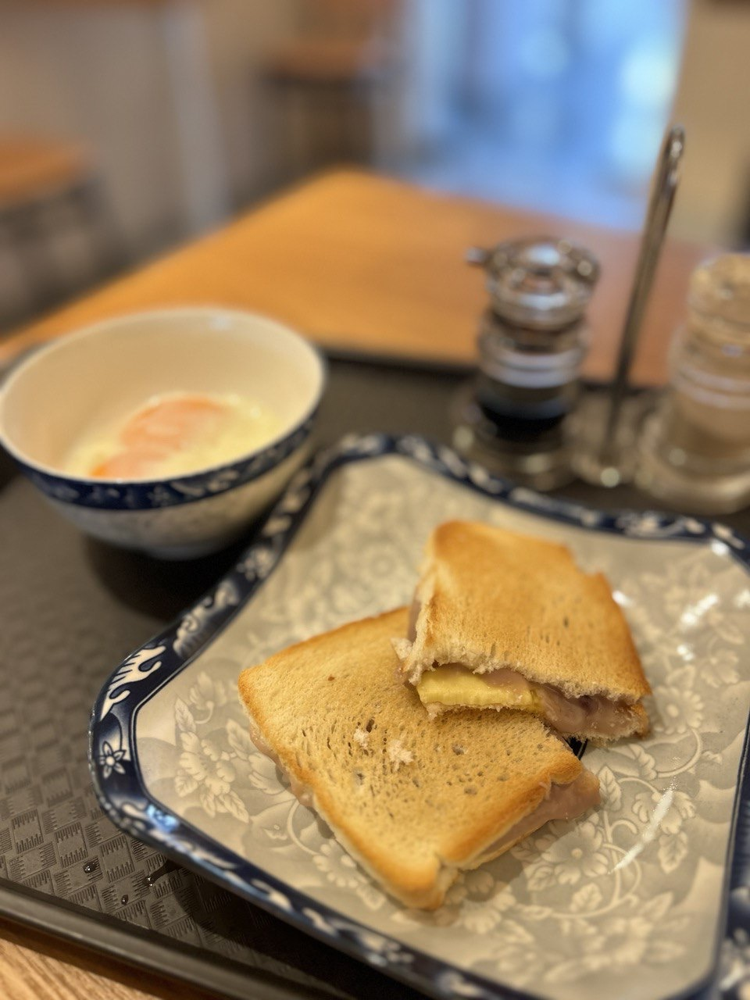
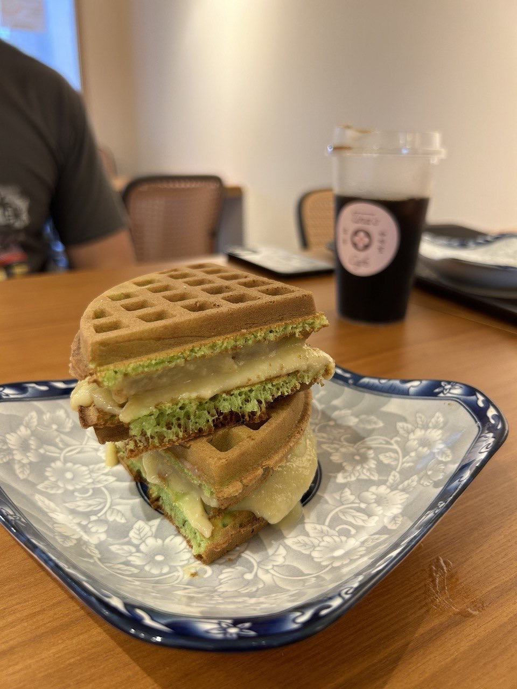
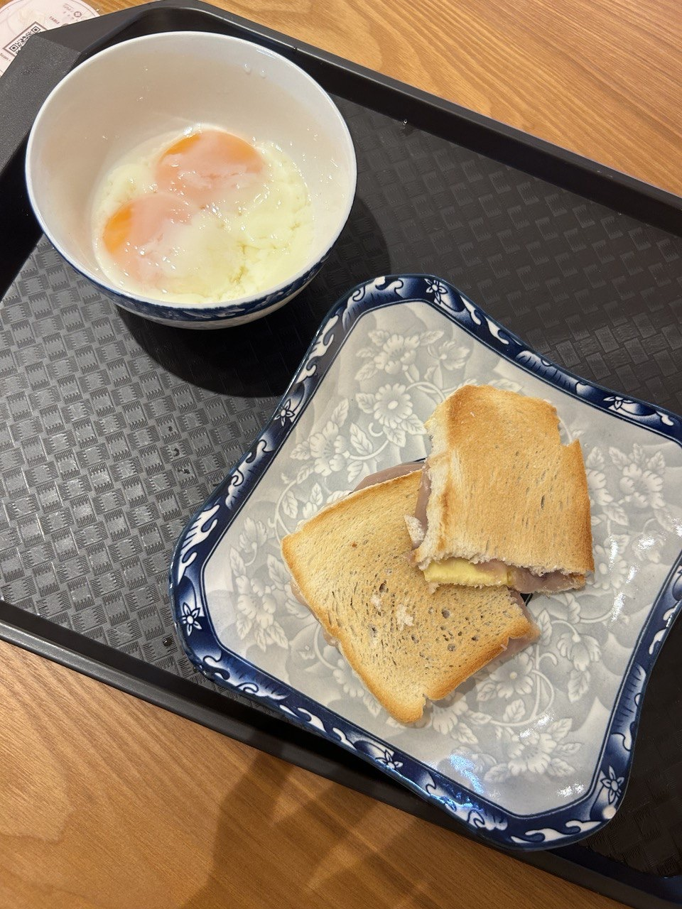
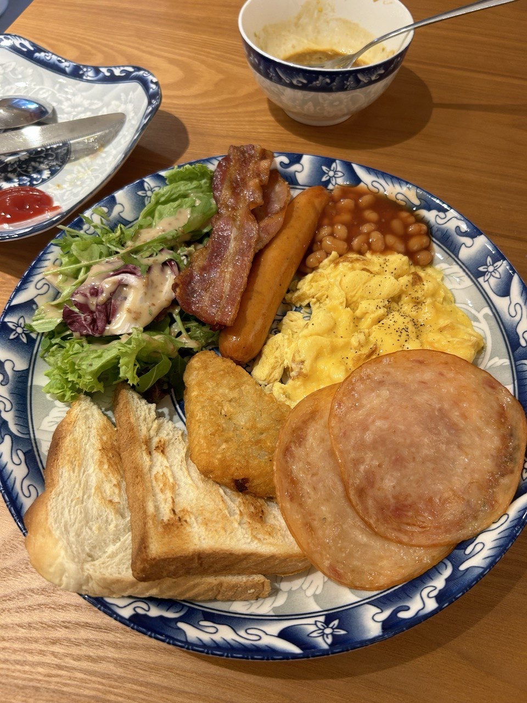


Blk 5 Everton Park, #01-22, Singapore 080005


Rating: 

Overshadowed by the other cafes here at everton park is Tina’s cafe, but don’t make the mistake of leaving this cafe out! Tina’s cafe was quite a hidden gem that we did not expect to find here! Came here during peak lunch crowd and the cafe was quiet and inviting. There is also ample parking at the MSCP nearby and this cafe accepts CDC vouchers, so please do support local!!

Ordered the orn nee butter toast - 6.50,  Tina’s breakfast platter - 14.80, homemade kaya waffle - 3.20. Total was about 25 for 2 people which is quite affordable for a cafe of this level.

Orn nee butter toast - 7/10. First time trying orn nee toast, was a very pleasant experience, orn nee wasnt too sweet but thick and creamy. My only complaint is that the butter melted too fast, I like a cold slab of butter to go with, and could have a bigger portion.

homemade kaya waffle - 7/10. Homemade kaya was done well, waffle was crispy and fluffy. Try dipping into eggs and soy sauce for a new flavor!!

GF review:
the breakfast platter though simple was nice and hearty. the beans were surprisingly salty but i quite liked it over its usual sweet counterparts. the bacon was savory and the hash brown was crispy. the eggs were cooked till supple and went well with ketchup. the chicken sausage was snappy too. overall, quite yum! however, i wish we could’ve tried the nasi lemak instead, because i do feel (in general) that breakfast platters can always be done at home for a fraction of the price. nonetheless awesome place

