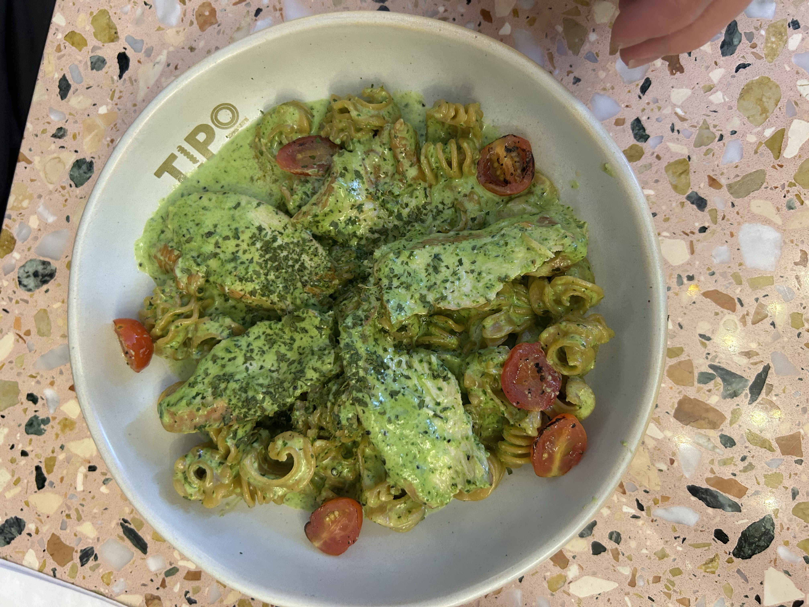
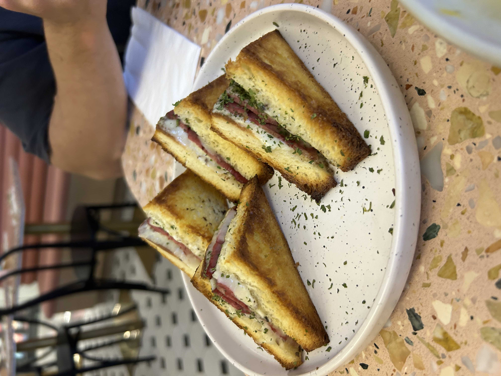


Orchard Road, #02-17/17A Wheelock Place


Rating: 

No doubt this is a classic pasta chain, specializing in unique pasta flavors and shapes monthly.

Ordered the chicken pesto which tasted superb except that the chicken was dry. The pesto sauce was flavorful and the pasta was served warm. Pasta was about ~ 18 SGD after gst, which is abit on the higher end. 8/10

Ordered Truffle Tramezzini. Was decent tasting and i would rate it 7/10 but considering it was about 15 SGD. It’s more like 5/10.

Girlfriend’s review
The duck carbonara is one of my faves. The flavors taste authentic and the pasta was cooked perfectly chewy. The duck was delicious as well. Don’t miss this one on the menu — 9/10

