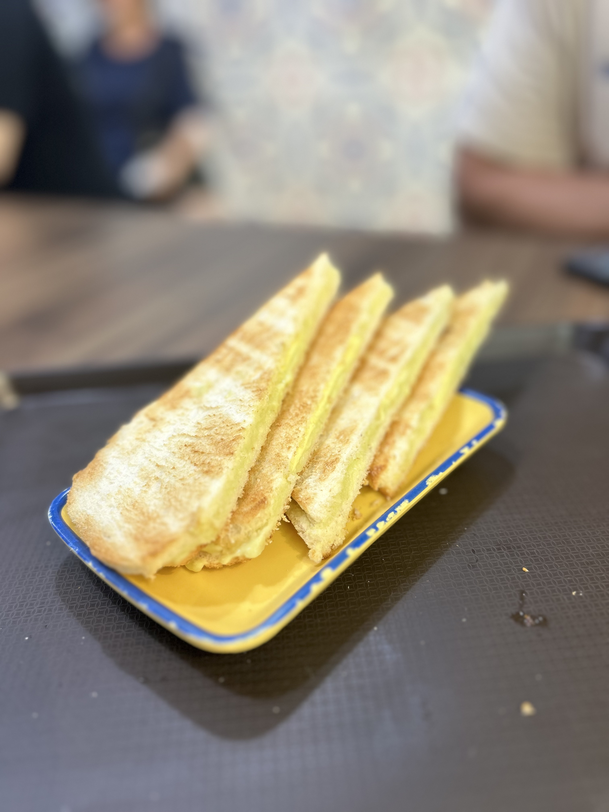
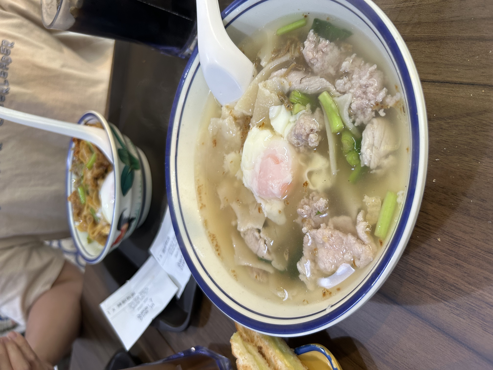


92 Lor 4 Toa Payoh, #01-274, Singapore 310092


Rating: 

Located in toa payoh, this is a nice and hearty cafe. Ordered the home made kaya toast - $2.80, chili pan mee - $6.80, mee hoon kuey - $5.80 and two kopi peng - $1.90 each. The home made kaya toast wasn’t very gao like i liked but at least the butter was sufficiently salted and goes well ~ 7.5/10. Chili pan mee had good liao but wasn’t the most flavorful, the egg was crazy creamy and so flavorful, but overall it was okay okay ~ 7/10.

GF review
The soup mee hoon kuey was quite normal. The noodles were chewy and thick and the minced meat was yummy as it had a bit of tendon inside, giving it an extra bite. the egg was poached perfectly and paired with the soup created a good combination of salty and creaminess. overall this is your standard mee hoon kueh/ soup banmian. however, i do find that you get more food if you order this over the dry variation, even though it’s $1 cheaper and it could do with more ikan bills.

Overall, this cafe has pretty nice aesthetics, good and welcoming service, decently priced with decent food. Not a bad place to drop by but not really quite a hidden gem like others described.

