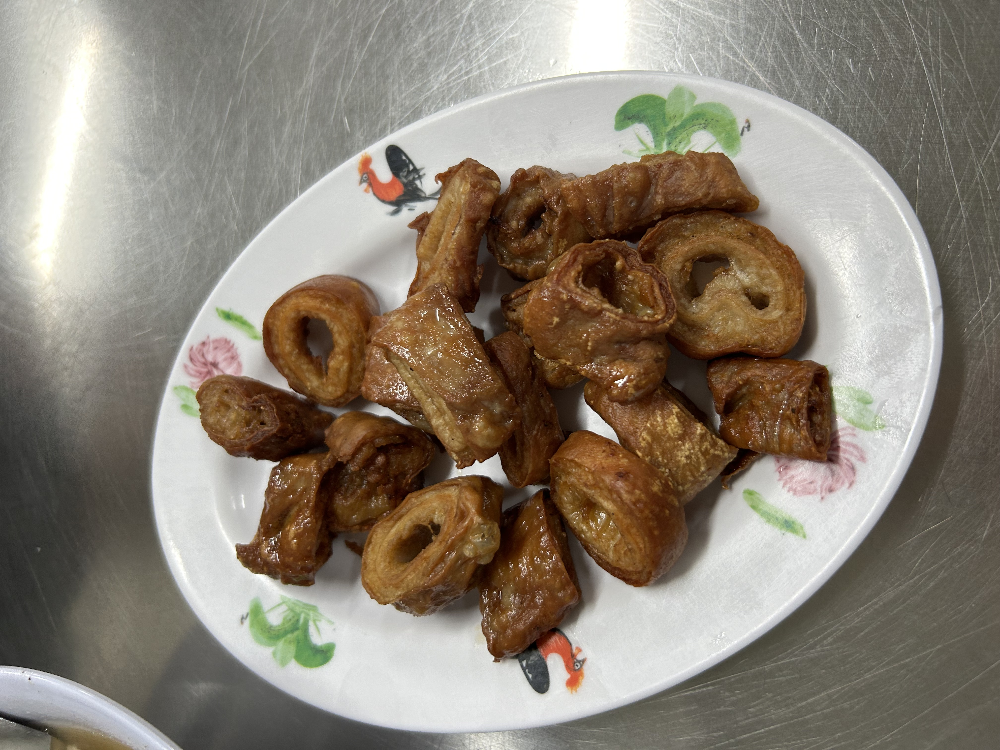


945 Serangoon Road, Singapore 534711


Rating: 

Located near the simon road famous star western, this is certainly very much overlooked!

Ordered 2 sets of the signature thai kway chap set. The soup was super peppery and tasty, filled with a generous amount of liao. The fried pork belly despite being in the soup was still so crispy and delicious, the fish sausage was surprisingly sweet but the taste was simply out of the world. The boiled intestine was unfortunately abit lacking. For $6, this is definitely a steal and a signature you have to order. 10/10

For sides, we got the fried intestines. Although the sides are more expensive, i would say they definitely elevate the experience. The fried intestine wasn’t too oiley, flavorful and very clean. Definitely  one of the best i had so far. 9/10, only because it’s slightly more pricey.

The thai red milk tea was a bit disappointing for a thai store, dint really like it so much. 6/10

Don’t miss this place as it’s a wonderful supper spot which closes at 3am. Bring more friends to share the sides with!

